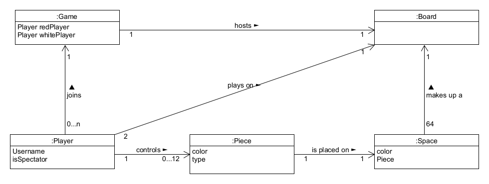
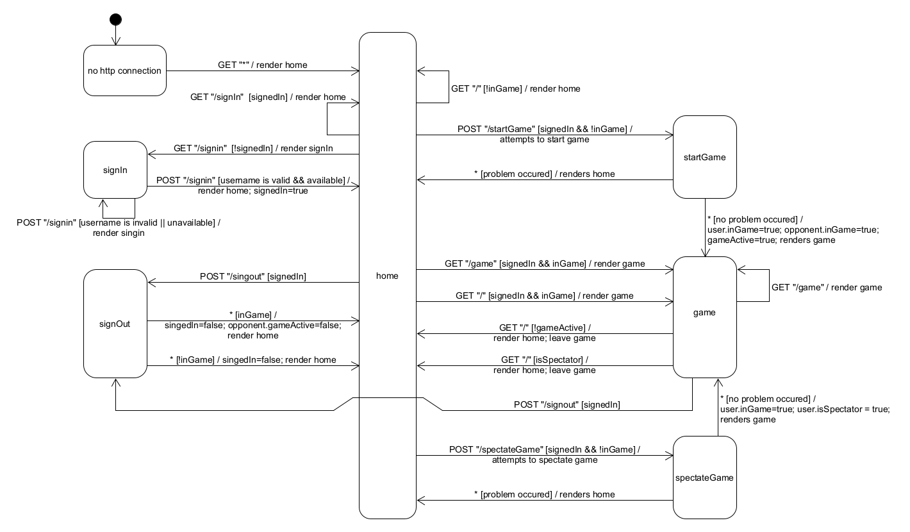
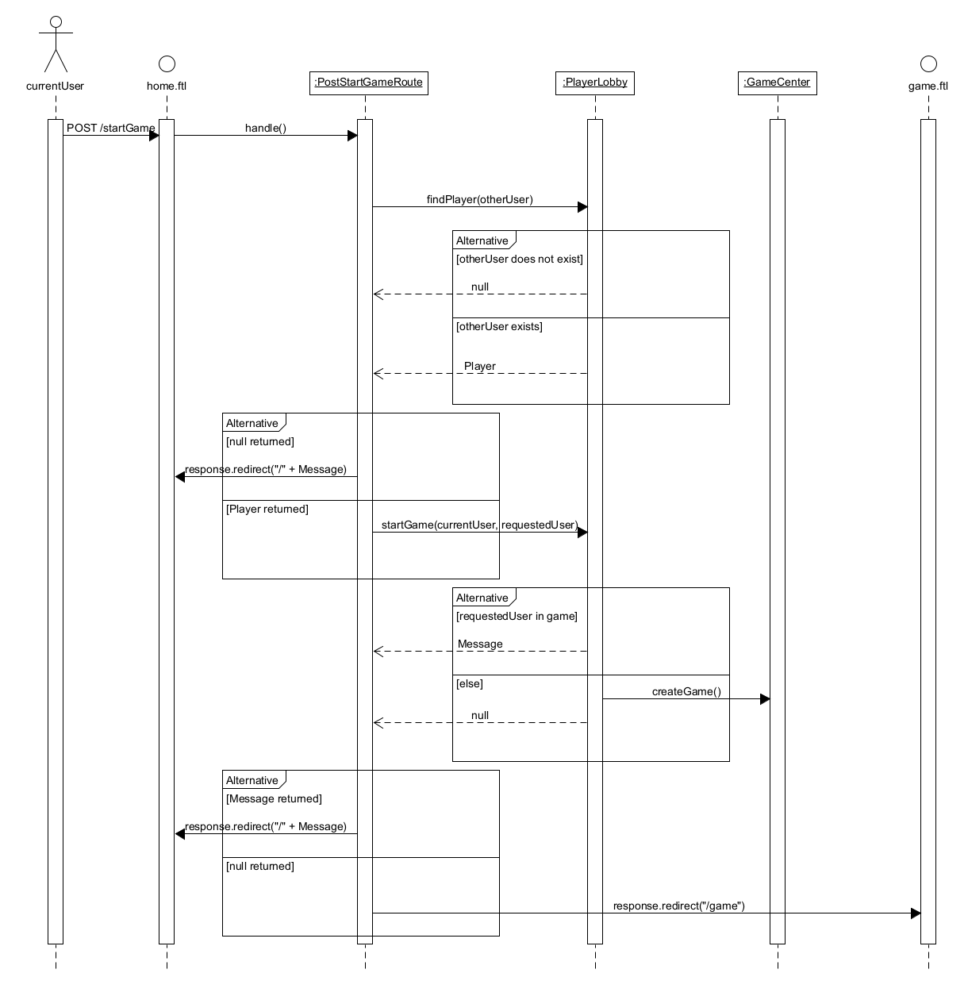
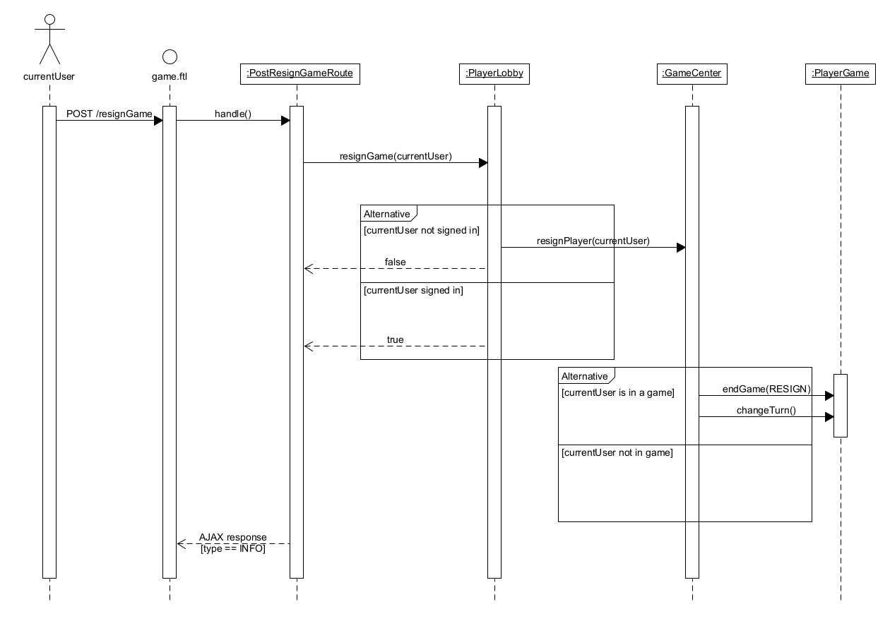

# PROJECT Design Documentation

## Team Information
* Team name: racecarbackwards
* Team members
  * Shayne Winn
  * Geran Vaughn
  * Sean McDonnell
  * Alexander Yu
  * Vishnu Muthuswamy

## Executive Summary
Our project is the implementation of a web-based checkers applications. The application allows
players who are signed in to play a game against each other. The game controls will utilize a
drag-and-drop utility to move pieces on the board.

Our project is also designed in a way to support multiple enhancements to the user and design
experience for future development.

### Purpose
The purpose of this project is to create a web-based checkers application. 
The most important user group for the project is the players, and the player's goal
is to be able to easily connect to and play a game with another player

### Glossary and Acronyms
| Term | Definition |
|------|------------|
| VO | Value Object |
|MVP|Minimum Viable Product|

## Requirements
This application allows a user to sign-in. When the user is signed in they will see a list of
currently available players, as well as options to spectate active games. The user can choose one 
of these players to challenge to a game of checkers. The game will automatically 
begin. This game is enforced by the American Rules and will not allow either player to make illegal moves. 
At any point either player can resign from the match, thereby forfeiting the match. Any user can 
sign-out at any point when they are finished playing.
If the user chose to spectate a game, they will be redirected to the active game where they can view,
but not influence the game board. The spectator can leave at any time by clicking the exit button.

### Definition of MVP
The Minimum Viable Product (MVP) only includes basic user sign-in, sign-out, and game logic. 
A user must be able to sign in to the website. Once signed in, the user must be able
to start a game with another user. The game of checkers must follow the American Rules.
Either player must be able to resign at any point, and sign out when they are finished playing.

### MVP Features
Player Sign-in

* _As a player I want to sign-in so that I can play a game of checkers._

Player Sign-out

* _As a player I want to sign-out when I am done playing checkers._

Start a Game

* _As a player I want to start a game so that I can play checkers with an opponent._

Player Movement

* _As a player I would like to make a move so that I can progress the game._

Movement Logic

* _As a piece I would like to make a legal move so that I can traverse the board._

### Roadmap of Enhancements

The enhancement that we did for the project was spectating.
After completing our minimum viable product, we moved onto to implementing 
the spectating game feature. We were able to implement efficiently
and effectively by utilizing the provided features and making minor
changes to how players and games are managed. If we were to continue 
further developing this project, the next enhancement that we would have
added would be an AI player. 

## Application Domain

This section describes the application domain.

A user can create a Game with another user. Any number of users can join the game as spectators;
Only the user that created the Game can play in the Game against only one other user. 
Each player can control 12 Pieces that are either red or white. Also, each Piece and be promoted to a king. 
A player can place a Piece on a Square which can either be black or white in color. 
Furthermore, there are 64 Squares on a Board. A Game creates a Board, and all players play on their Game's Board.

## Architecture and Design

This section describes the application architecture.

### Summary

The following Tiers/Layers model shows a high-level view of the webapp's architecture.

As a web application, the user interacts with the system using a
browser.  The client-side of the UI is composed of HTML pages with
some minimal CSS for styling the page.  There is also some JavaScript
that has been provided to the team by the architect.

The server-side tiers include the UI Tier that is composed of UI Controllers and Views.
Controllers are built using the Spark framework and View are built using the FreeMarker framework. 
The Application and Model tiers are built using plain-old Java objects (POJOs).

Details of the components within these tiers are supplied below.

### Overview of User Interface

This section describes the web interface flow; this is how the user views and interacts
with the WebCheckers application.

When a user opens the application, they are directed to the home page.
On the home page, the user is able to see the number of players online.
If the user is not signed in, they have the ability to use the sign in 
feature which renders the sign in page. The user from the sign in page
is redirected back to the home page when they successfully sign in.
When a player is signed in on the home page they can spectate a game, 
challenge another player, be challenged by another player, or sign out. 
The home page refreshes every 10 seconds to update the list of players 
online and to redirect players who have been challenged to their games.
When a player challenges another player, if that player is not already 
in a game, the players are redirected to the game page when the home 
page refreshes. If the player challenged is already in a game, then 
the user remains on the home page. If the user spectates a game, the 
user is redirected to the active game view. While on the game page, the 
user is either a player or a spectator. If the user is a player, they will
be able to make a move on their turn and resign at any time. The game ends when
either player wins, or a player resigns. If a user is a spectator, they are
able to leave at any time up until the game ends. When a game ends, players
and spectators are redirected to the home page when they click the exit button.
When a user signs out, their name is removed from the list of online players 
when the home page refreshes.

### UI Tier
When the user first connects to the application, the GetHomeRoute is called and displays
the home.ftl FreeMarker file. From there the user can click the Sign In button, which
will call the GetSigninRoute to display the signin.ftl FreeMarker file. When the user
enters in a valid username, PostSigninRoute is called, enters them into the PlayerLobby,
and redirects them back to the home.ftl. The user now has the option to sign out by
clicking the sign out button, which will call the PostSignoutRoute, removing them from
the PlayerLobby, and redirecting the to the home.ftl. While signed in, the user can 
select another player to begin a game. This calls the PostStartGameRoute which assigns
both players to a Game in the GameCenter. After the game has been created, both users
are redirected to the game.ftl FreeMarker file via the GetGameRoute.

While in an active game, the board is updated through the PostCheckTurnRoute which will
redirect the player who is waiting for their turn to start to the game.ftl. If a user 
moves a piece, the PostValidateMove Route is called to validate whether the move is 
valid or not according to the American Checkers Rules. After a move is validated, the 
user can then choose to either submit their turn or backup their move. If they choose 
to backup their move, the PostBackupMoveRoute is called and resets the board to the 
move prior. If the user chooses to submit their turn, then the PostSubmitTurnRoute is 
called to do end of turn clean up. The route will check whether there was any multiple 
jumps available, changing turns, as well as checking for lose conditions. If a player 
chooses to manually resign or if they reached a lose condition, the PostResignGameRoute 
is called and the game is ended. After the game has ended, both users may stay in the 
game until they click the exit button, where the GetHomeRoute redirects the user to the home.ftl.

Figure 4 contains the sequence diagram for starting a game. When a user starts a game with another player, they
send a request to the PostStartGameRoute through the home.ftl. From here, the Route calls the PlayerLobby to check
if the requested player exists. PlayerLobby then returns the player if they exist, or null if they don't. If PlayerLobby 
returned null, the user is sent back to the home.ftl with a message stating the user doesn't exist. If the user does 
exists, both users are sent to the PlayerLobby to start a game. From there, PlayerLobby determines if the requested user 
is already in a game and will return a message if so. If the user is not already in a game, a call is made to GameCenter 
to start a game between the two players and afterwards, a value of null is returned to the PostStartGameRoute. Finally, 
if a message was returned from PlayerLobby, the user is sent back to the home.ftl stating why the game hadn't started. 
If null was returned from PlayerLobby, the user is sent to the game.ftl page.

### Application Tier
When a user signs in to the application, the user is placed into the PlayerLobby.
The PlayerLobby controls all aspects of user interactions, such as signing in
and out and challenging users. When a user challenges another user, a Game is
created and is added into the GameCenter. The GameCenter controls all aspects
of game management, such as game creation and destruction, player assignment,
and resignation. When a game ends and both players return to the home.ftl,
the game is removed from the GameCenter. When a user signs out, they are
removed from the PlayerLobby.

An example of these responsibilities can be found in Figure 5, a sequence diagram 
demonstrating the process by which a user resigns from a game. This process begins with a
POST "/resignGame" call to our webserver. This gets routed through the handle function within 
PostResignGameRoute. This function simply hands the responsibility to PlayerLobby, who then 
verifies that the player is a valid player. If the player is valid, it then tells GameCenter to 
resign this player from their game. First GameCenter checks that the player is actually in a game. 
This check prevents errors from being thrown if a POST call gets delayed or is called when it
shouldn't be. If the player is in a game, the game is ended with the proper reason, and the turn
is changed. Finally after all this, a AJAX response is sent, simply holding a message containing 
good news, the resignation was a success.

### Model Tier
The Game class controls all aspects of an individual game, such as the creation
of the board, move validation, and changing of turns. When a game is created, two
Player objects are assigned to the game as the red and white players. Then a 
2D array is filled with Row, Space, and Piece objects to represent the initial 
state of a Checkers game. Whenever a user requests to view the game board, a 
BoardView is created, which consists of Iterators. When a move is made during 
a game, a Move object, consisting of two Position objects is sent to the Game 
class for move validation. Move validation occurs across several of the methods 
in the Game class, to allow the enforcement of the American Checkers Rules, adding 
and removing pieces from spaces, and promoting pieces.

### Design Improvements
If we were to continue this project after this course, we would work on refactoring
our Game class. Currently, most of our logic in the Model Tier is found within
this one class. We feel it would be better divide up the responsibilities better
across the individual classes in the Model Tier.

Additionally, there were several points during our development where we added onto
parameter requirements for methods, instead of reworking the method to require
less information. For example, our validateJumpMove() and validateSimpleMove() methods
went from only requiring a move to be passed into, to requiring the move and board,
then requiring a move, a board, and a boolean on whether we wanted to make the move or not.
We could have rewritten our methods to not require the boolean at all.

Another improvement would be the way in which end game conditions are currently displayed.
With our current system, the only messages that are displayed are if a player resigns or
disconnects from the match. So if a player loses a match normally, it will display a 
message saying that the player has resigned. We could have set up a condition to check
if the player has lost but did not resign, and if that condition were true we would display
a different losing message.

## Code Metrics
For our analysis, we looked at several metrics, including Chidamber-Kemerer, Complexity, Javadoc Coverage,
Lines of code, and Martin Packages. Of these, only the Complexity metrics produced results that indicate areas of
improvement, which we go into more detail on below.

### Package Level
Our analysis of the code metrics at the package level shows that each package falls within an acceptable range. This
indicates that there is no immediate need for refactoring between packages. The Model tier is higher than the other
packages, however this is expected due to holding much of the logic that takes place for the game.

### Class Level
We have three areas for improvement on the Class level. The first is in the Game class where most of the move validation
takes place. Due to the complexity and enforcement on rules for American Checkers, we find ourselves having a large
amount of conditional logic branches. In the future, we could rewrite several of these methods to reduce the overall
number of branches, such as simplifying the logic or merging methods together.

The next area for improvement is in the GetHomeRoute class. Much of the logic in this class pertains to making sure that
a valid user is active and can view the home.ftl. While we could reduce some of the nested conditional statements, we
feel the class should stay as is due to the necessity of the logic and for the superior readability.

The final area for improvement is the PostSubmitTurnRoute class. Our main issue with this class is it has far too much
logic tied to it when should be used solely as a way to route information to the other classes. Creating a new class
in the Model tier that holds the validation of turns would reduce the overall complexity and keep the route more in line
with its intended purpose.

### Methods Level
Much of our improvements is similar to our Class level improvements. Our first area of improvement is found in the Game
class where we have our search and validation methods when a piece is moved. Much of this code is copied and pasted, 
but slightly changed due to slight differences in logic (validating a simple move vs validating a jump move). We could
work to reducing the inner conditional logic to reduce in some areas, such as looking at how to merge validation of
a move when the piece is either white or red.

The next area for improvement would handle method in the GetHomeRoute class. Similar to our explanation in our Class
level analysis, we believe that, while simplification could be made, we opted for a slightly longer implementation
to improve readability.

The final area for improvement is the handle method in the GetSubmitTurnRoute class. Once again, similar to our
explanation in the Class level analysis, much of this complexity could be moved to a new class in the Model tier to
bring the route more in line with its intended purpose. However, to reduce the complexity, we feel it we could improve
on our block of conditional logic that enforces the priority of moves (simple vs jump vs continuing a multi-jump).

## Testing
### Acceptance Testing
The stories included in our acceptance testing consist of the stories required by our MVP, as well the enhancement 
concerning spectating the game. Currently, 100% of our user stories have passed their acceptance criteria.

### Unit Testing and Code Coverage
The strategy used in our UI tier was to test every situation in which a user could navigate through our application. 
Our tests took into account whether the user was logged in, had an active session, or were in an active game, as well 
as any combination of those three. This was to ensure that no scenario would lead a user at an error screen in our 
application. This led to having a 90% coverage of code at the UI tier. The main loss of coverage is due to the 
WebServer file which was provided to us and went untested.

The strategy used for our Application tier was ensuring proper logging in, logging out, game creation, game ending,
and spectating of games. We looked at scenarios where people would start a game and ensured that the proper messages 
and states were being returned when the criteria were met. We wanted to make sure that no one would appear to stay
logged in after they logged out, couldn't join a game that was already be played by other users, and spectating games
that a user was still in. This testing led to having a 98% coverage of code at the Application tier. The main loss of 
coverage is due to not checking each scenario of multi-conditional if statements.

The strategy used for our Model tier was ensuring proper setting of status for players, updating the game board, and 
the application of our movement logic. We looked at scenarios that involved changing of turns, players leaving the game, 
players starting to spectate, and every scenario a piece can be in. Our main work went into the movement validation 
and we were able to test nearly every scenario that could lead to a meaningful decision to be made by our application. 
This testing led to having a 97% coverage of code at the Model tier. The main loss of coverage is due to not checking 
each scenario of multi-conditional if statements, as well as failing to account for specific cases in movement logic.
